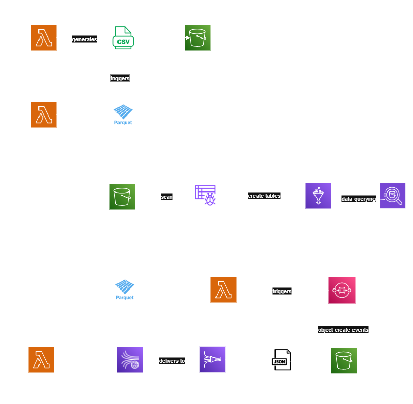

# AWS Stock Market Data Pipeline (Batch & Streaming)

## 🧠 Summary  
This is a data engineering project designed to simulate both **batch and streaming data processing** using AWS data services.

---

## 📌 Overview  
The project simulates dummy data for both **daily** and **real-time** stock price data for multiple companies. It processes the data via **Lambda functions**, stores it in **partitioned Parquet format on S3**, and makes it available for querying in **Athena**.

---

## ☁️ AWS Services Used And Purpose

- S3 --> used as the data lake to store both raw and clean data.
- Lambda --> used for serverless data ingestion, transformation and loading.
- Kinesis Data Streams --> transports simulated real-time stock data to Firehose.
- Kinesis Firehose --> Buffers and delivers streaming data from Kinesis Data Streams to an S3 staging bucket for further processing.
- SQS --> works as a middle decoupling layer between S3 and the stream-processing Lambda.
- Glue Catalog --> serves as the metadata layer, allowing Athena to interpret and query the Parquet files stored in S3.
- Athena --> enables SQL-based querying on the cleaned and partitioned Parquet datasets.

---

## 🏗️ Project Architecture



---

## 🔍 Architecture Explanation

### 🔹 High-Level View
The pipeline has two main flows:

1. **Batch Path** – Simulates and processes historical stock prices.  
2. **Streaming Path** – Processes real-time (simulated) price updates.

Both paths output clean, queryable **Parquet files** to S3 and expose them via **Athena**.

---

### 🗃️ 1. Batch Processing Pipeline

#### 1. `generate_stock_batch_data` (Lambda)
- Generates simulated daily stock prices.
- Writes raw CSV files to **S3 staging bucket**.

#### 2. `process_batch_stock_data` (Lambda)
- Triggered by **S3 PUT** events.
- Reads CSV from S3.
- Cleans and transforms the data:
  - Ensures proper types
  - Drops nulls
- Appends to **clean Parquet S3 path** partitioned by year.
- **Avoids duplicates** Existing records do not get inserted again.

#### 3. Athena Table: `price_by_date`
- Points to the clean Parquet data on S3 **(price_by_date)**.
- Enables querying historical batch prices.

---

### ⚡ 2. Streaming Processing Pipeline

#### 1. `write_records_to_stream` (Lambda)
- Simulates and sends random stock price records to **Kinesis Data Stream**.
- Kinesis Firehose consumes those records.

#### 2. Kinesis Firehose
- Buffers and delivers JSON records to S3 staging bucket.
- Those S3 staging bucket events get directed to an SQS queue.
- The advantage of using an SQS queue over direct JSON S3 PUT event triggers is decoupling
- The second purpose for using SQS is to trigger less lambda instances (Maximum concurrency in the SQS lambda trigger configuration).

#### 3. `process_stock_stream_data` (Lambda)
- This AWS Lambda function is triggered by an SQS queue subscribed to an S3 event notification.
- Reads the staged JSON from S3.
- Applies transformations:
  - converts types (numbers and timestamps)
  - Drops bad/missing records
  - Adds `etl_loading_ts` and partition columns
- Writes clean data to **S3 Parquet path (`price_by_date_stream`)**.
- Queries Athena for the **latest price per symbol** (snapshot).
- Writes the **latest snapshot** to another S3 path (`latest_stream_prices`).

#### 4. Athena Tables:
- `stream_prices_history`: Full stream history  
- `latest_prices`: Latest price snapshot (updated after each stream batch)

---

## 🚀 Getting Started

1. **Create** S3 bucket(s) for staging and clean layers.  
2. **Set up IAM roles** with correct permissions for Lambda, Firehose, Athena, SQS and S3.  
3. **Deploy Lambda functions** 
4. **Set environment variables** 
5. Set up:
   - **S3 to Lambda Trigger in process_batch_stock_data**   
   - **Kinesis Firehose** → S3
   - - **Create SQS Queue** → S3  
   - **S3 Event Notifications** → SQS  
   - **SQS Trigger with Lambda process_stock_stream_data** →   
7. **Create Glue Tables** (via Crawler or manually).  
8. **Query your data** using Amazon Athena.

---

## 📂 Folder Structure

```bash
/    ← Repository root
├── Scripts 
│   ├── Jupyter Notebooks				  # Contains old scripts used for testing locally
│   ├── Lambda Functions
│	│	├── With env variables 
│	│	│	├── generate_stock_batch_data.py
│	│	│	├── process_batch_files_lambda.py
│	│	│	├── process_stock_stream_data (without SQS).py
│	│	│	├── process_stock_stream_data.py
│	│	│	├── write_records_to_stream.py
│	│	├── Without env variables
│	│	│	├── generate_stock_batch_data.py
│	│	│	├── process_batch_files_lambda.py
│	│	│	├── process_stock_stream_data.py
│	│	│	├── write_records_to_stream.py
├── .gitignore      
├── README.md
├── Stocks_Project_Arch.drawio			  # DRAW.IO file used to create the diagram
├── Stocks_Project_Arch.drawio.png        # Diagram image used in README

